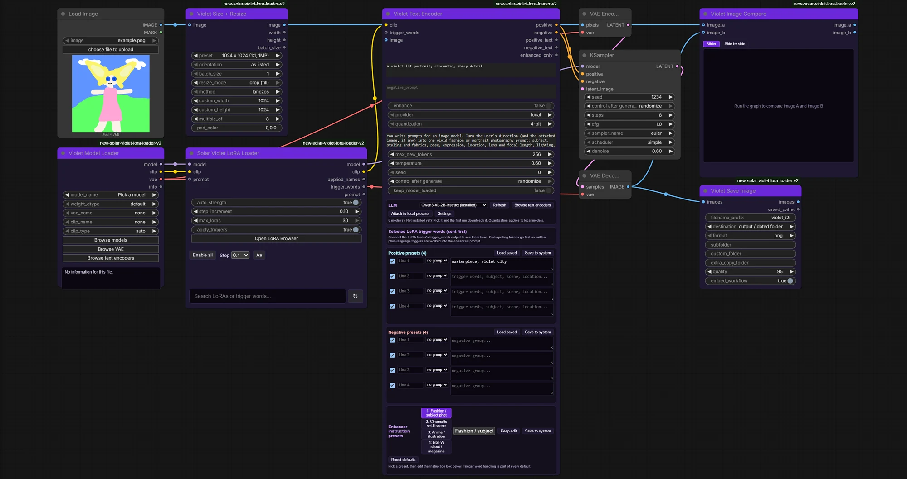
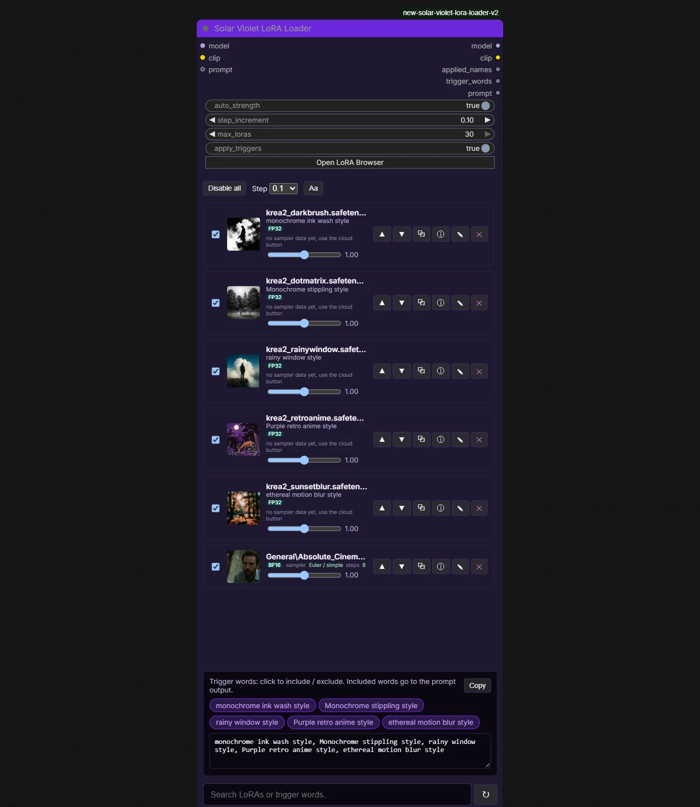

# Solar Violet Nodes

ComfyUI custom nodes by **Violet Diffusion AI**: typed model loaders, a LoRA loader that scrolls and grows with your stack, a text encoder, image tools, and a model and LoRA browser with a duplicate finder that works across every ComfyUI model folder. Free, MIT licensed.



## What is new in 1.0.0

- **LoRA loader node, rebuilt.** Large strips with preview, base model, trigger words and a strength slider each. The scroll bar and mouse wheel work, the search box and trigger-word panel are bigger, and the node grows as you load more LoRAs (up to ten strips, then the list scrolls). Strip size, text size and spacing are adjustable with the **Aa** button.
- **Every ComfyUI model folder is a category.** Checkpoints, diffusion models, GGUF, VAE and text encoders are tabs; every other folder ComfyUI or your nodes register (`controlnet`, `clip_vision`, `upscale_models`, `ipadapter`, ...) is in the **More ComfyUI folders** list.
- **Extra folder paths for any category.** **Folders / settings** takes one path per line and applies at once, no restart.
- **Full duplicate removal in the model browser.** Identical files, the same CivitAI model across versions, and names that match once version, epoch and precision tags are stripped. Tick suggested, Shift-click a range, then Recycle bin, set aside in a `_violet_duplicates` folder, or delete. It never lets you remove every copy in a group.
- **Image to image workflow, bundled.** `example_workflows/Violet_image_to_image.json` and a low-VRAM version (`Violet_image_to_image_low_VRAM.json`, GGUF) show up under **Workflow > Browse Templates** once the pack is installed.



## Also in the pack

- **Violet LoRA Browser** (`Ctrl+Alt+L`) and **Violet Model Browser** (`Ctrl+Alt+M`): click to select, Shift-click for a range, hover for a card, move to folder with undo, organize loose files by metadata, CivitAI fetch.
- **Model libraries:** use a Stability Matrix or any other model tree as it is, with no moving or symlinks.
- **Network sources:** browse another computer's ComfyUI models (browse only) over its stock API.
- **Typed loaders, Violet Text Encoder** (presets and an optional LLM enhancer), **image tools** (Save Image, Size + Resize, Image Compare). Full list in [docs/NODE_REFERENCE.md](docs/NODE_REFERENCE.md).
- **What is next:** the rest of the nodes and the standalone versions are planned in [docs/ROADMAP.md](docs/ROADMAP.md).

## Install

Clone into ComfyUI's `custom_nodes` folder and restart ComfyUI:

```
cd ComfyUI/custom_nodes
git clone https://github.com/Violinet-tech/solar-violet-nodes.git
```

Or download the zip from [Releases](https://github.com/Violinet-tech/solar-violet-nodes/releases) and unpack it there. Needs a current ComfyUI frontend. GGUF loading needs [ComfyUI-GGUF](https://github.com/city96/ComfyUI-GGUF).

## Notes

- CivitAI lookups are by file hash and cached next to each file as `<name>.violet.json`.
- Nothing is removed until you confirm. Removal goes to the Recycle bin, a `_violet_duplicates` folder next to the file, or is deleted, whichever button you press.

## License

MIT, see [LICENSE](LICENSE). Copyright (c) 2026 Violet Diffusion AI.
